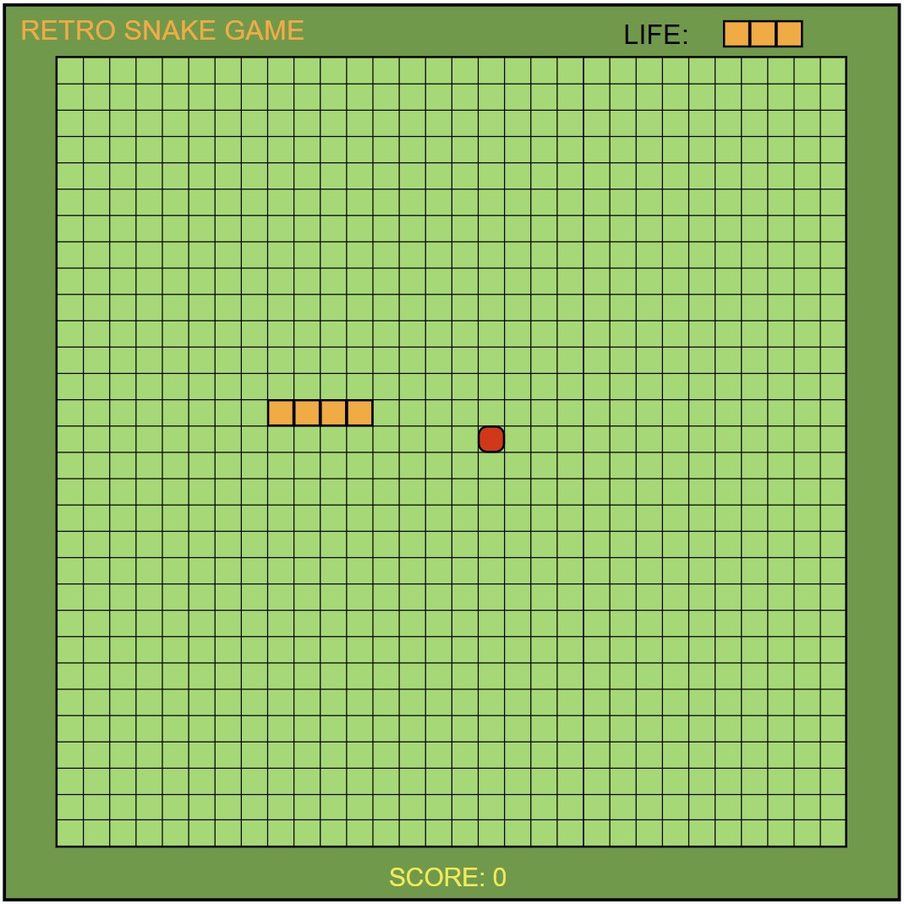

# Snake retro game

## Table of contents
* [General info](#general-info)
* [Technologies](#technologies)
* [Mockup](#mockup)

## General info

A popular platform snake game written in Python using the pygame library. 
The player has 3 lives to use. If the snake hits the edge of the screen or his tail, 
the player loses one life. If a player loses all 3 lives, the game ends.
Every time the snake eats an apple, the snake grows one square and
 the player scores 10 points.

## Technologies
Project is created with:
* Python 3.11
* Pygame library version: 2.6.1

## To do list
- [X] Creating a blank canvas and Game Loop 
- [X] Creating the Food
- [ ] Creating the Snake
- [ ] Moving the Snake
- [ ] Making the Snake eat the Food
- [ ] Making the Snake grow longer
- [ ] Checking for collision with edges and tail
- [ ] Adding title and frame
- [ ] Keeping score 
- [ ] Adding sounds

## Mockup

